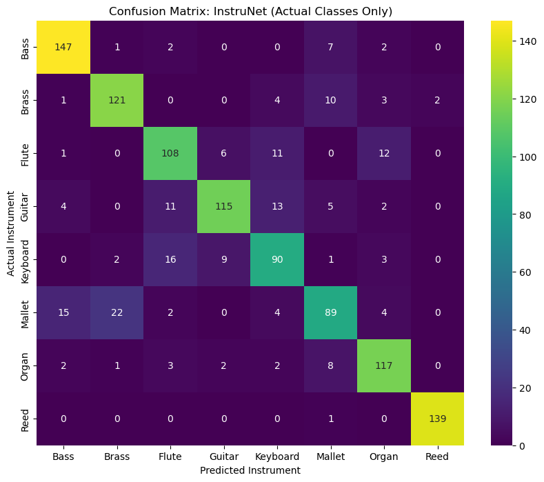
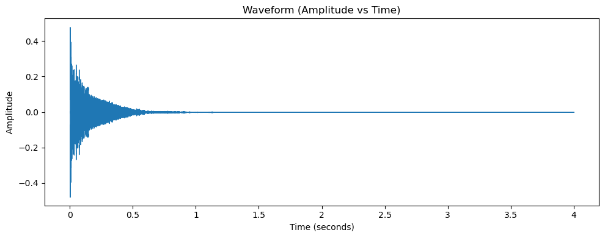
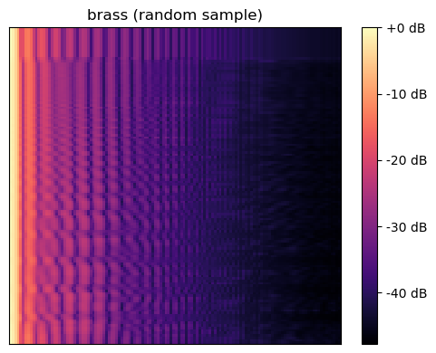
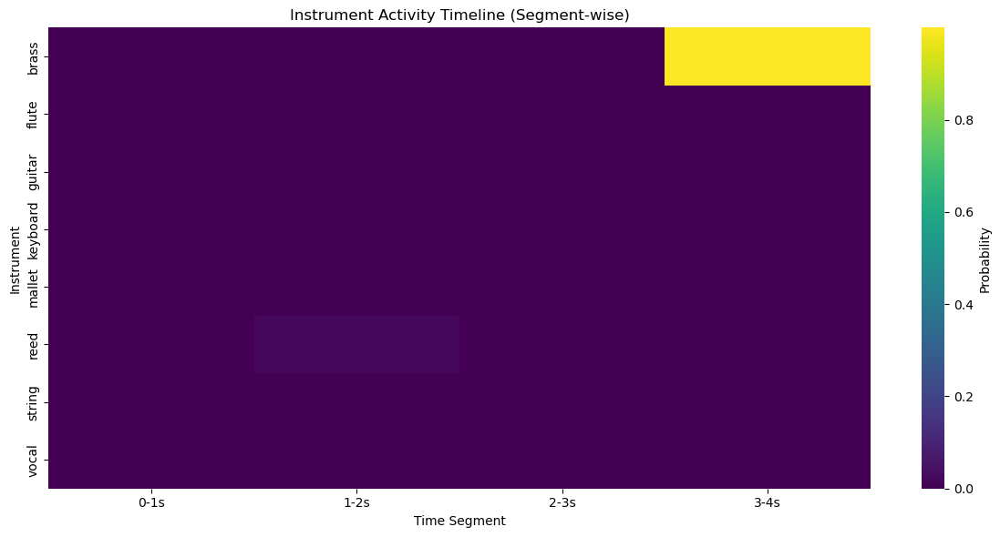

# 🎵 InstruNet AI  
### CNN-Based Music Instrument Recognition System

---

## 📌 Project Overview

InstruNet AI is a deep learning-based system that automatically detects musical instruments from audio tracks using Convolutional Neural Networks (CNNs) applied to Mel-Spectrogram representations.

This project implements a complete end-to-end pipeline including:

- Audio preprocessing  
- Spectrogram generation  
- CNN training  
- Model evaluation  
- Visualization  
- JSON & PDF report generation  

---

## 🎯 Objectives

- Convert audio signals into Mel-Spectrogram images
- Train a CNN model for instrument classification
- Perform confidence-based predictions
- Generate segment-wise instrument activity timeline
- Export structured JSON & PDF reports

---

## 🛠️ Technology Stack

- Python 3  
- Librosa  
- TensorFlow / Keras  
- NumPy  
- Matplotlib  
- Seaborn  
- Scikit-learn  
- ReportLab  

---

# 📅 Milestone-Wise Development

---

## 🚀 Milestone 1: Data Collection & Preprocessing

### Dataset Preparation
- Loaded acoustic dataset
- Total samples: 6813

### Spectrogram Processing
- 128 Mel bands
- Log-scale conversion (dB)
- Resized to 128 × 128
- Normalized between 0 and 1

Final CNN Input Shape:
```
(6706, 128, 128, 1)
```

✅ Dataset successfully prepared for CNN training.

---

## 🧠 Milestone 2: CNN Model Development

### Model Architecture

- Conv2D (32 filters)
- MaxPooling
- Conv2D (64 filters)
- MaxPooling
- Conv2D (128 filters)
- MaxPooling
- Flatten
- Dense (128)
- Dropout (0.5)
- Output Layer (Sigmoid)

Total Parameters: **3.3 Million**

### Training Setup

- Optimizer: Adam  
- Loss: Binary Crossentropy  
- Batch Size: 32  
- EarlyStopping Enabled  
- Train/Validation Split: 80/20  

---

## 📊 Milestone 3: Model Evaluation & Optimization

### Final Validation Accuracy

```
86.8%
```

### Classification Metrics

- Precision ≈ 0.85  
- Recall ≈ 0.85  
- F1-Score ≈ 0.84  
- Overall Accuracy ≈ 85%  

---

### 📈 Training Accuracy & Loss Curves



This graph shows:
- Increasing training accuracy
- Stable validation accuracy
- Decreasing loss
- No severe overfitting

---

### 🔥 Confusion Matrix



The confusion matrix visualizes prediction performance across instrument classes.

---

## 🌐 Milestone 4: Deployment & Visualization

### Real-Time Prediction

Steps:
1. Load audio file  
2. Convert to Mel-Spectrogram  
3. Normalize  
4. Predict probabilities  
5. Apply confidence threshold  

Example Output:
```
brass : 100.0%
```

---

### 📊 Visualization Features

#### 🎼 Mel Spectrogram


#### ⏱ Segment-wise Instrument Timeline


Audio is divided into 1-second segments and analyzed independently to detect instrument activity over time.

---

# 📁 Report Generation

## JSON Report

Generated:
```
instrument_analysis_report.json
```

Includes:
- Audio file name
- Analysis timestamp
- Overall prediction
- Segment-wise timeline
- Model performance summary

---

## PDF Report

Generated:
```
instrument_analysis_report.pdf
```

Includes:
- Structured instrument analysis
- Timeline table
- Confidence summary

---

# 📂 Project Structure

```
├── milestone_2_and_3.ipynb
├── output_*.png
├── instrunet_final.keras
├── instrument_analysis_report.json
├── instrument_analysis_report.pdf
└── README.md
```

---

# 🔧 Installation

```
pip install numpy matplotlib librosa tensorflow scikit-learn seaborn reportlab
```

---

# ▶️ Usage

### Train Model
```
python model_training.py
```

### Run Prediction
```
python inference.py
```

---

# 🧠 Learning Outcomes

- Applied CNNs to audio spectrograms  
- Built multi-class instrument classifier  
- Implemented segment-wise audio analysis  
- Created automated JSON & PDF reporting  
- Developed complete ML deployment pipeline  

---

# 🚀 Project Status

✅ End-to-End Functional  
✅ CNN Trained & Optimized  
✅ Visualization Integrated  
✅ Automated Reporting Implemented  
✅ Milestone-Based Development Completed  

---

# 👨‍💻 Author

Sai Deva Harsha

---

⭐ If you found this project interesting, feel free to star the repository!
