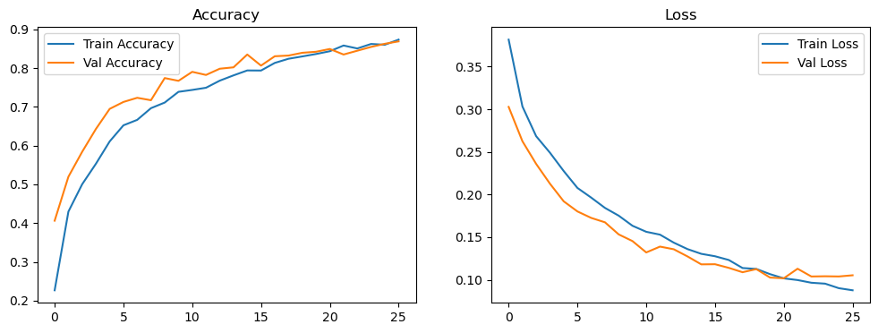
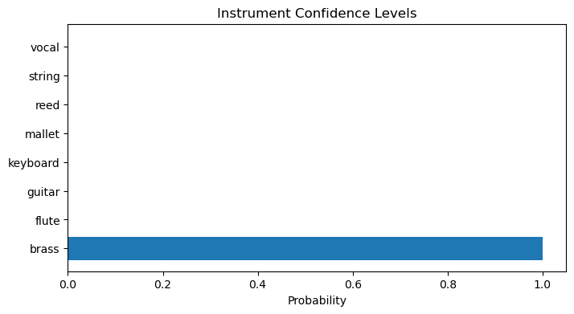

# 🎵 InstruNet AI  
## CNN-Based Music Instrument Recognition System

---

## 📌 Project Overview

InstruNet AI is a deep learning-based audio classification system that detects musical instrument families from audio files using Convolutional Neural Networks (CNNs) applied to Mel-Spectrogram representations.

This project implements a complete end-to-end ML pipeline:

- Acoustic preprocessing
- Mel-spectrogram generation
- CNN training & evaluation
- Segment-wise timeline detection
- Confidence visualization
- JSON & PDF report generation

---

# 🏗️ Milestone-Based Development

---

# 🚀 Milestone 1: Data Collection & Preprocessing

### 🔹 Raw Acoustic Data

- Loaded: **6813 raw audio samples**
- Sampling rate: **16,000 Hz**
- Converted to Mel-Spectrograms (128 Mel bands)
- Cropped to 128×128
- Normalized between 0–1

Final CNN Input Shape:

```
(6706, 128, 128, 1)
```

Final Label Shape:

```
(6706, 11)
```

### 🎼 Instrument Families

- Bass
- Brass
- Flute
- Guitar
- Keyboard
- Mallet
- Organ
- Reed
- String
- Synth
- Vocal

### 🎵 Example Mel Spectrogram


---

# 🧠 Milestone 2: CNN Model Development

## 🔹 Dataset for Training

Dataset Shape:
```
(5600, 128, 128)
```

Train / Validation Split:
- Train: 4480 samples
- Validation: 1120 samples
- Split ratio: 80 / 20

---

## 🔹 CNN Architecture (InstruNet)

```
Input (128x128x1)

Conv2D (32 filters, 3x3) + ReLU
MaxPooling (2x2)

Conv2D (64 filters, 3x3) + ReLU
MaxPooling (2x2)

Conv2D (128 filters, 3x3) + ReLU
MaxPooling (2x2)

Flatten
Dense (128) + ReLU
Dropout (0.5)

Output Layer (Sigmoid)
```

Total Parameters:
```
3,305,096
```

### 🔹 Training Configuration

- Optimizer: Adam
- Loss: Binary Crossentropy
- Batch Size: 32
- Epochs: 50 (Early Stopping enabled)
- Patience: 5

---

# 📊 Milestone 3: Model Training & Evaluation

## 🔹 Training Progress

Training stopped at **Epoch 26** using EarlyStopping.

Final Validation Accuracy:

```
86.8%
```

---

## 📈 Accuracy & Loss Curves



Observations:

- Accuracy steadily increased
- Validation closely followed training
- Loss decreased smoothly
- No major overfitting observed

---

## 🔥 Classification Report

Validation Accuracy ≈ **0.85**

Macro Avg:
- Precision: 0.85
- Recall: 0.85
- F1-Score: 0.84

---

## 🔥 Confusion Matrix


The confusion matrix shows strong performance across most instrument classes, with highest accuracy for:

- Reed
- Vocal
- Bass
- String

---

# 🎧 Milestone 4: Inference & Visualization

After training, the model is saved as:

```
instrunet_final.keras
```

---

## 🔹 Audio Prediction

Example prediction:

```
brass : 100.0%
```

Threshold used:
```
0.5
```

---

## 🌊 Waveform (Amplitude vs Time)


---

## 🎼 Mel Spectrogram (Inference Input)


---

## 📊 Instrument Confidence Levels



Displays probability distribution across instrument classes.

---

## ⏱ Segment-wise Instrument Timeline

Audio is split into 1-second segments and analyzed individually.

Timeline Output Shape:
```
(4, 8)
```


This heatmap shows instrument probability variation over time segments.

---

# 📁 Milestone 5: Report Generation

The system automatically generates structured reports.

---

## 📝 JSON Report

File Generated:
```
instrument_analysis_report.json
```

Includes:
- Audio file name
- Analysis timestamp
- Overall dominant instrument
- Confidence percentage
- Segment-wise timeline
- Model performance summary

---

## 📄 PDF Report

File Generated:
```
instrument_analysis_report.pdf
```

Generated using:
- ReportLab
- Structured tables
- Timeline summary
- Overall prediction

---

# 📂 Project Structure

```
├── milestone_2_and_3.ipynb
├── instrunet_final.keras
├── instrument_analysis_report.json
├── instrument_analysis_report.pdf
├── output_0_1.png
├── output_10_1.png
├── output_12_0.png
├── output_16_0.png
├── output_18_0.png
├── output_21_0.png
└── README.md
```

---

# 🛠️ Installation

```
pip install numpy matplotlib librosa tensorflow scikit-learn seaborn reportlab
```

---

# ▶️ Usage

### Train Model
```
python training.py
```

### Run Inference
```
python inference.py
```

---

# 🧠 Key Learning Outcomes

- Applied CNNs to audio spectrogram data
- Built multi-class instrument classifier
- Implemented EarlyStopping for optimization
- Generated confusion matrix & classification reports
- Built segment-wise time analysis system
- Automated JSON & PDF report generation
- Created full ML production pipeline

---

# 🚀 Project Status

✅ Data Preprocessing Complete  
✅ CNN Model Trained  
✅ Validation Accuracy: 86.8%  
✅ Confusion Matrix Evaluated  
✅ Inference Pipeline Built  
✅ Timeline Visualization Working  
✅ JSON Report Generation  
✅ PDF Report Generation  

---

# 👨‍💻 Author

Sai Deva Harsha  

---

⭐ If you found this project useful, feel free to star the repository!
